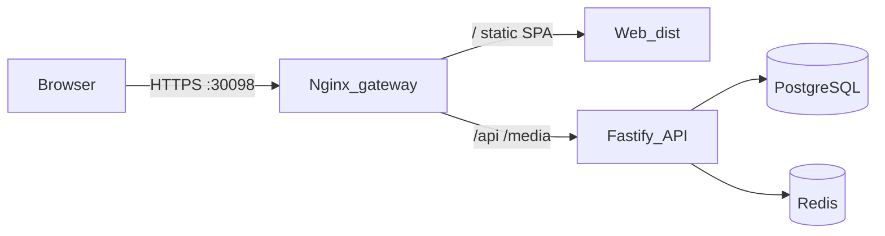

# Production website deployment (Ubuntu + Docker)

This guide deploys MeetCon as a **website only** on port **30098** with one public HTTPS origin. PostgreSQL, Redis, and the API stay on a private Docker network.

## Architecture



Public URL example: `https://meetcon.example.com:30098`

Set `WEB_ORIGIN` to that exact value (including `:30098`) so session cookies, CORS, password-reset links, and meetup QR codes match.

## Prerequisites

- Ubuntu VM with Docker Engine and Compose plugin v2
- DNS pointing at the VM
- TLS certificate for your hostname (corporate CA or ACME DNS-01; HTTP-01 on port 80 is not used by this stack)
- Firewall allowing **only** inbound TCP `30098` (or `GATEWAY_PUBLIC_PORT` from `.env.production`):

  ```sh
  chmod +x deploy/meetcon.sh
  ./deploy/meetcon.sh firewall
  ```

  Docker maps **`0.0.0.0:<GATEWAY_PUBLIC_PORT>` on the VM → port `30098` on the `gateway` container**. The API (`3001`) is not published to the host.

## One-time setup

1. Clone the repository on the VM.
2. Copy environment file and edit secrets:

   ```sh
   cp .env.production.example .env.production
   nano .env.production
   ```

   Generate `TOKEN_ENCRYPTION_KEY`:

   ```sh
   node -e "console.log(require('crypto').randomBytes(32).toString('base64url'))"
   ```

   Set `WEB_ORIGIN=https://your-domain:30098` and strong `POSTGRES_PASSWORD` / SMTP credentials.

3. Install TLS files (see [deploy/certs/README.md](certs/README.md)):

   - `deploy/certs/fullchain.pem`
   - `deploy/certs/privkey.pem`

4. Start the stack:

   ```sh
   chmod +x deploy/meetcon.sh
   ./deploy/meetcon.sh up
   ```

   Or manually:

   ```sh
   docker compose --env-file .env.production -f docker-compose.prod.yml up -d --build
   ```

5. Verify:

   ```sh
   docker compose --env-file .env.production -f docker-compose.prod.yml ps
   ./deploy/meetcon.sh doctor
   curl -k "https://your-domain:30098/health"
   ```

   `./deploy/meetcon.sh doctor --full` runs the full validation script (Postgres, Redis, API, gateway, port `30098`).

6. Smoke-test in a browser: signup, login, create meetup, join flow, refresh on `/admin` and `/app`, profile photo upload, timed question SSE, logout.

## Updates (rolling deploy)

1. Backup database: `./deploy/meetcon.sh backup`
2. Pull new code and rebuild:

   ```sh
   docker compose --env-file .env.production -f docker-compose.prod.yml up -d --build
   ```

   Or use the CI helper (same steps as Jenkins deploy):

   ```sh
   ./deploy/meetcon.sh deploy
   ```

   For Jenkins, see [deploy/jenkins/README.md](jenkins/README.md) and the root `Jenkinsfile`.

   The `migrate` service runs before `api` starts.

3. Watch logs: `docker compose --env-file .env.production -f docker-compose.prod.yml logs -f api gateway`

Do **not** use `run.sh` / `run.bat` in production.

## Android app (later)

Build the release APK with the same origin:

```text
gradlew.bat assembleRelease \
  -PmeetconWebUrl=https://your-domain:30098 \
  -PmeetconAppLinkHost=your-domain
```

The app uses a full-screen WebView with **no URL bar**. Only the configured MeetCon origin (including port) stays inside the app.

## Monitoring checklist

- TLS expiry on `deploy/certs`
- Disk use for Docker volumes (`postgres_data`, `media_data`)
- `docker compose ... ps` health status
- Gateway/API logs for HTTP 5xx
- Scheduled `./deploy/backup-postgres.sh` plus off-VM copy of `.env.production` secrets

## Rollback

Keep the previous image tags or git commit. Restore database from `backups/*.sql.gz` only if a migration requires it. Migrations are forward-only; test upgrades on a staging VM first.
